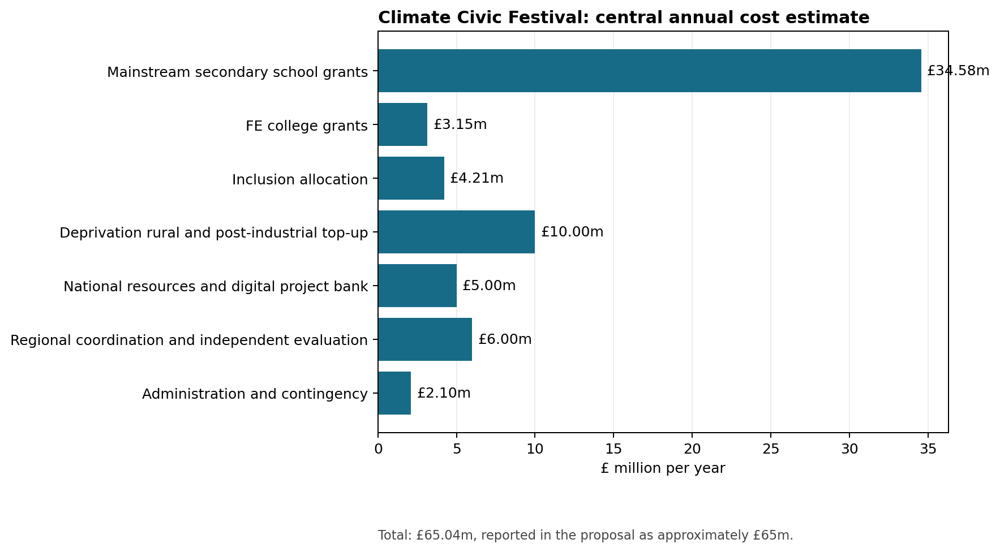
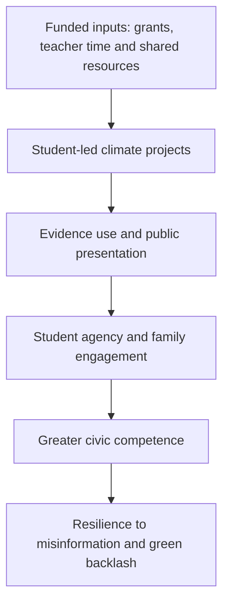

# Climate Civic Festival

An independent post-hackathon public policy project proposing an annual, student-led Climate Civic Festival for secondary-age learners in England.

[Read the full policy proposal](docs/Climate_Civic_Festival_Proposal.pdf)



## Policy problem

Climate concern remains widespread in the United Kingdom, while support for particular policies can weaken when transition appears costly, unfair or institutionally remote. The proposal treats green backlash as a challenge of civic trust and agency. It asks how education can help future citizens assess evidence, discuss distributional trade-offs and develop locally credible responses.

## Proposed intervention

Schools, further-education colleges and secondary-age inclusion settings would run six short preparation sessions followed by one annual public festival day. Student groups would choose a climate-related project, use evidence, produce a public output and explain its implications for fairness or community benefit.

The design would operate through existing climate-action and enrichment infrastructure. A preregistered cluster-randomised pilot would establish effects, workload and unit costs before national expansion.

## Theory of change



Existing research supports the component mechanisms. The complete festival remains a proposed intervention whose combined effect requires empirical testing.

## Cost and funding model

The central planning estimate is **approximately £65 million per year** after national rollout. The proposed Carbon Market Civic Dividend would allocate Treasury funding equal to **2.5% of forecast UK Emissions Trading Scheme receipts**. A capped allocation from incremental Electricity Generator Levy receipts would support high-need settings and temporary revenue shortfalls.

The repository includes machine-readable versions of the proposal's national cost estimate and funding scenarios. A short Python script reproduces the headline totals and generates the cost chart.

```bash
python analysis/reproduce_costing.py
```

## Repository contents

| Path | Purpose |
|---|---|
| [`docs/Climate_Civic_Festival_Proposal.pdf`](docs/Climate_Civic_Festival_Proposal.pdf) | Full independent policy proposal |
| [`data/national-cost-estimate.csv`](data/national-cost-estimate.csv) | Annual rollout cost assumptions derived from Table 6 |
| [`data/funding-scenarios.csv`](data/funding-scenarios.csv) | UK ETS allocation scenarios derived from Table 7 |
| [`analysis/reproduce_costing.py`](analysis/reproduce_costing.py) | Reproduces totals and regenerates the chart |
| [`visuals/cost-breakdown.png`](visuals/cost-breakdown.png) | Visual summary of annual programme costs |

## Project status and scope

This is an exploratory undergraduate policy project developed after a collaborative policy hackathon. It represents independent work completed after the event. The proposal synthesises evidence and develops an implementable policy design; it does not report the results of an implemented programme.

Cost figures are planning estimates derived from the assumptions documented in the proposal. Pilot evidence would be required to validate the grant formula, workload model and outcome measures.

## Author

**Rohan Neelala**  
[LinkedIn](https://uk.linkedin.com/in/rohan-neelala-8a398b329) | [Substack](https://eklavyaphilosophy.substack.com/)

Copyright © 2026 Rohan Neelala. All rights reserved.
