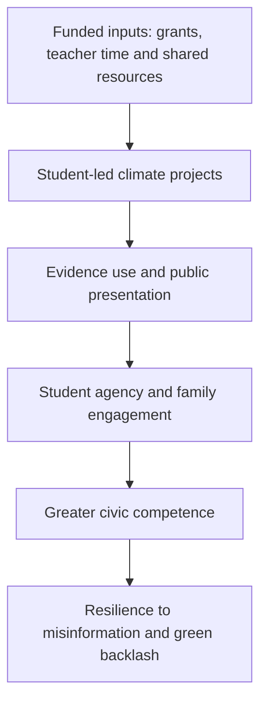

# Climate Civic Festival

An independent post-hackathon public policy project proposing an annual, student-led Climate Civic Festival for secondary-age learners in England.

**[Read the full 11-page policy proposal](docs/Climate_Civic_Festival_Proposal.pdf)**

## One-page summary

### The problem

Climate concern remains widespread in the United Kingdom, while support for particular policies can weaken when transition appears costly, unfair or institutionally remote. The proposal treats green backlash as a challenge of civic trust and agency. Education can help future citizens assess evidence, discuss distributional trade-offs and develop locally credible responses.

### The proposal

Schools, further-education colleges and secondary-age inclusion settings would run six short preparation sessions followed by one annual public festival day. Student groups would choose a climate-related project, use evidence, produce a public output and explain its implications for fairness or community benefit.

| Element | Central proposal |
|---|---|
| Delivery | Existing climate-action and enrichment infrastructure |
| Participation | Secondary-age students in mainstream, FE and inclusion settings |
| Annual cost | Approximately £65 million after national rollout |
| Primary funding | Treasury allocation equal to 2.5% of forecast UK ETS receipts |
| Evaluation | Preregistered cluster-randomised pilot before national expansion |

### Theory of change



Existing research supports the component mechanisms. The complete festival remains a proposed intervention whose combined effect requires empirical testing.


## Reproducing the costing

The repository includes the proposal's cost assumptions and UK ETS funding scenarios as CSV files. The accompanying Python script checks the headline calculations and regenerates the chart.

```bash
python analysis/reproduce_costing.py
```

The script requires Python and `matplotlib`.

## Repository contents

| Path | Purpose |
|---|---|
| [`docs/Climate_Civic_Festival_Proposal.pdf`](docs/Climate_Civic_Festival_Proposal.pdf) | Full independent policy proposal |
| [`data/national-cost-estimate.csv`](data/national-cost-estimate.csv) | Annual rollout cost assumptions derived from Table 6 |
| [`data/funding-scenarios.csv`](data/funding-scenarios.csv) | UK ETS allocation scenarios derived from Table 7 |
| [`analysis/reproduce_costing.py`](analysis/reproduce_costing.py) | Checks the calculations and regenerates the chart |
| [`visuals/cost-breakdown.png`](visuals/cost-breakdown.png) | Visual summary of annual programme costs |

## Project status

This is an exploratory undergraduate policy project developed after a collaborative policy hackathon. It represents independent work completed after the event. The proposal synthesises evidence and develops an implementable policy design; it does not report the results of an implemented programme.

Cost figures are planning estimates derived from the assumptions documented in the proposal. Pilot evidence would be required to validate the grant formula, workload model and outcome measures.

## Author

**Rohan Neelala**  
[LinkedIn](https://uk.linkedin.com/in/rohan-neelala-8a398b329) | [Substack](https://eklavyaphilosophy.substack.com/)

Copyright © 2026 Rohan Neelala. All rights reserved.
